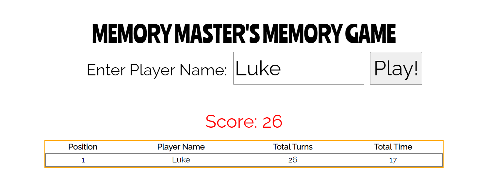
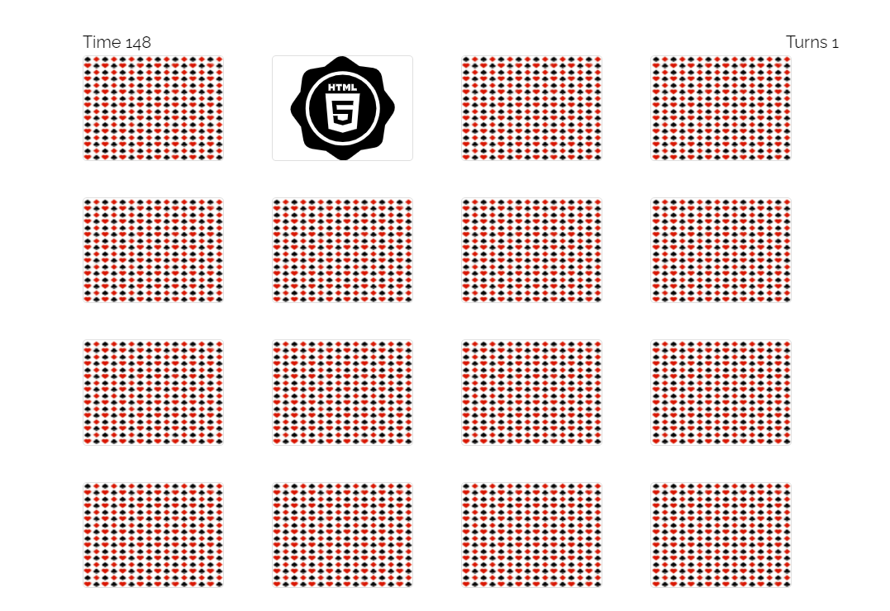
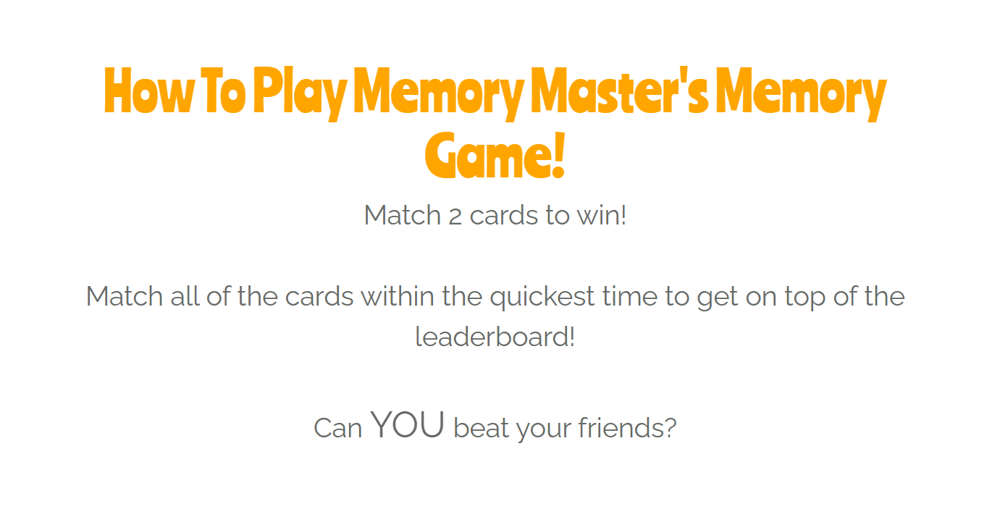

# 
[Memory Master's Memory Game](https://drogrinhunter.github.io/test_memory_game/)

# About The Game
Memory Master's Memory Game is a card matching game for those looking to improve their memory skills.
Players will race against the countdown timer to beat the game whilst keeping a track of their scores which will show the user how well their
skills are improving.

The game is very short but allows the user to compete against themselves or their friends with the ability to screen capture the leaderboard to 
share with theirs friends and families. 

 

## UX 
## Strategy and Scope

### Who are the intended users of this game? 
* People who wish to improve their memory skills.
* People who wish to play a quick game to put their minds to something different. 

### User Stories
1. As a player, I want to be able to play a game that involves my memory so I can improve those skills.
- The user will be able to play the game after they have inputted their details in the leaderboard section which will then move onto the game once submitted. 

2. As a player, I want to know how to play the game so I do not waste time figuring it out.
- After the user has inputted their details, they will be able to find out how to play the game by clicking the "How To Play" button in the navigation menu. 

3. As a player, I want to be able to see my score so I can see how well I am performing.
- The user will be able to keep track of their score by being able to watch the timer countdown and how many turns they have had as well as the leaderboard at the end of the game.  

4. As a player, I want a game that is easy to use and visually simple so I don't feel overwhelmed whilst playing the game.
- The game has been developed to include minimalist functions so the game itself is the main focus for the user. There are no other distractions for the user when playing the game, all they have to do is type their name and away they go.  

## Structure and Skeleton
### Wireframes
* You can view the Wireframes [here](wireframes/mmmg.pdf)

### How To Play
1. Open the [Memory Master's Memory Game](https://drogrinhunter.github.io/memory_masters_memory_game/).
2. Enter a player's name and click "Play!"
3. Click on the cards to find all the different matches! 
* When a pair of cards have been matched together, they will disappear from the game board as to not confuse the user.
* After each card has been clicked, the turn counter will increase by 1 each time.
* As soon as a card has been clicked, the countdown timer will start allowing the user 150 seconds to complete the game.
* As soon as all cards have been matched, the game will take the user back to the leaderboard highlighting where they are on the board.
* The user has the ability to play again to improve their scores.

## Features
### Existing Features 
**Leaderboard** - The first screen that is presented to the user is the leaderboard, which allows the user to see any previous scores, input their name and then click "Play!" to start the game.
  

**Navigation Bar** - The navigation bar allows the user to either play the game or read the "How To Play" section which allows the user to read how the game is play.
  

**Main Gameboard** - The game consists of 16 tiles (with the back of the cards visible to the user), the timer on the top left hand side of the gameboard which counts down from 150 seconds and the "Turns" counter on the top right which will increase by 1 every time a card is clicked.
The main faces of the cards are only visible once the card is selected.
  
 

**How To Play Section** - There is a section in the game which allows the user to read up on how to play the game, this is done by a link in the navigation bar at the top of the screen.
  

## Future Features
**Multiplayer** - I would like to add the ability for multiple players locally at the same, allowing for more enjoyment from the users.

**Online Multiplayer** - I would like to add the ability for users to play alongside their friends at the same time wherever they are in the world. 

**Difficulty** - I would like to add the option of having harder levels so once they have finished the game the game would move to another level which increases in difficulty and only go back to the leaderboard once the time on the particular level has expired.

## Technologies 
In this game, I have used the following languages and frameworks: 

*HTML* - this project uses HTML for structure. 
*CSS* - this project uses CSS for styling.
*Javascript* - this project mainly uses Javascript to create and control dynamic content in the game.
*Google Fonts* - this project uses [Google Fonts]("https://fonts.google.com") to style the fonts in this game.
*Bootstrap* - this project uses [Bootstrap]("https://getbootstrap.com") to improve navigation around the game. 
*Balsamiq* - Balsamiq has been used to create the wireframes used in this project. 

  

## Surface
### Game Design
The game has been designed to be as simple and minimalist as possible. It is my opinion that having a simple design for the game would improve the user's experience as they would not get distracted on 
other aspects that are on the page and distrupting their gameplay. 

The white background has been used as it looks clean and the colors used (black, red and orange) are used to highlight the areas that the user needs to look at. The back of the playing cards have a similar 
design to actual playing cards that the user might have around the house which helps the user to become familar with the game as the design is something that they might be used too. 

The card faces have images that relate to web development, such as JS, CSS and HTML - this has been done deliberately as the game now has a multi purpose,  it poses as a generic memory game for normal users but for 
those who are in the web development industry it is something that they are used to and is fun and friendly as they use those languages / frameworks on a regular basis.

## Testing
The testing that has been undertaken and results are listed below: 
* Testing the input form to ensure that the user has to input their name before the game can carry on
    * If you do not input a name then the form input box will pop up to advised that it is a required element. 
* Ensuring that the leaderboard only allows 10 scores
    * I played the game 12 times to ensure that the top 10 scores are listed.
* Ensuring that cards disappear once matched
    * I played the game and when the 2 cards matched, they disappeared which backed up the hypothesis.
* Ensuring that the "Turns" counter increased by 1 every time a card was clicked
    * I clicked on the same card multiple times to ensure that the counter increased by one - I tested this on different cards refreshing the page after each time.

### Bugs
Throughout this project, there has been bugs that have been fixed. Some of the bugs and resolutions are listed below: 
* When adding new scores, the JS function is not working.
    * In the array that pushes the score to the leaderboard, there was an ";" instead of ",".
* The cards were not flipping 
    * In the turnCard function, I missed a "=" in the if statement.
* The cards were not shuffling when the game was refreshed.
    * in the shuffleCards function, where you use the Math.random function, the "m" was not capitalised. 
* The card back would not disappear when clicked.
    * I added backface-visibility to the CSS class `card-back` as well as `card-picture`. 

#### Remaining Bugs 
* When the timer counts down to 0 the game does not stop, it continues to count down. 

## Project Credits & Acknowledgements
* All images have been obtained from [SVG Repo]("https://www.svgrepo.com/") which is a website that you can get copyright free images.
* The key concepts of HTML, CSS and JS have been learnt from the Code Institue course materials and read further materials from [Mozilla Developer Network]("https://developer.mozilla.org/en-US/docs/Web/JavaScript") and [Eloquent Javascript]("https://eloquentjavascript.net").
* [Fisher-Yates Shuffle Algorithm]("https://bost.ocks.org/mike/shuffle/") - this was used to shuffle the cards.
* [Countdown Timer]("https://www.w3schools.com/js/js_timing.asp")
* [Grid layout and properties]("https://www.w3schools.com/css/css_grid.asp")
* [Extra Javascript Information]("https://www.freecodecamp.org/news/learn-javascript-full-course/") - I used Free Code Camp JS tutorials for certain functions.

I used other resources from [StackOverflow]("https://StackOverflow.com") and [W3Schools]("https://w3schools.com") for troubleshooting issues during the project as well as support from my mentor.

    
[Back To The Top](#about-the-game)